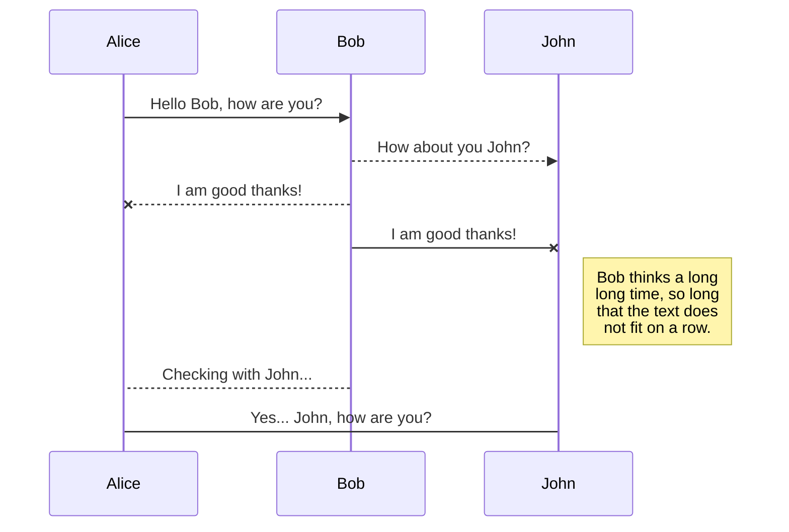
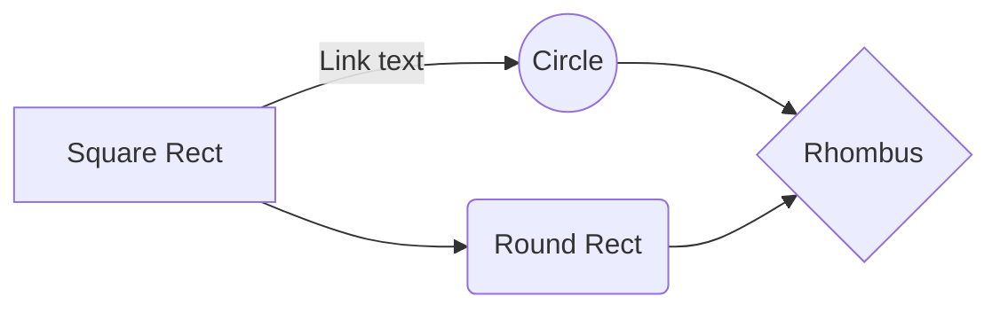

# CITS3403
For this project you are required to build a data analytics application, which allows users to upload private data, view automated analysis of their data and then selectively share the results with other users. You may interpret the concept of "data" and "analysis"  _very_ _flexibly_. For example, the application could be:

-   An exercise tracking application, where users track their exercise habits, can view stats about their habits, and share information about their achievements with their friends on the system.
-   A statistical analysis tool, allowing users to upload certain types of datasets (e.g. timeseries, tabular data), and then run standard statistical analysis algorithms (e.g. regression, clustering, outlier detection) on them, and share their findings and datasets with their colleagues.
-   A course-selector tool, allowing users to upload details (e.g. times, duration, credit hours) of courses they are interested in taking, and then run scheduling algorithms to generate a plausible selection of units, and allowing users to share suggested schedules with their classmates.
-   A tournament management system, where users can input results of sports/board games tournaments, see player stats, and then share results with other users.
-   An infectious disease monitoring system where users can upload datasets of infections, and the application will plot them on a map and you can share areas with high outbreaks to other users.
-   A news sentiment analysis tool, allowing users to upload or input news content, and then analyse the text using NLP algorithms (e.g., sentiment scoring) to determine overall sentiment, and share the analysed data with their colleagues.
Any method of data entry is fine. For example data could be manually entered by the user, or uploaded in batches in a suitable file format, or automatically sourced from other devices and services (e.g. fitness trackers, smart watches, publicly available feeds and datasets).

Please think carefully about the design of the application. It should be:

-   _Engaging_, so that it looks good and focuses the user on important elements of the application.
-   _Effective_, so it produces value for the user, by providing information, entertainment or community.
-   _Intuitive_, so that it is easy for a user to use.
# Ideas
## Dungeons and dragons:
- Upload: Open character sheet into website/save character details from it
- Data Analysis

- Pros:
	- Cool format to upload
- Cons:
	- Don't really know D&D that much

## Club Manager:
- Upload: Member list (details?) 
- Data Analysis: Attendence/membership over time, finances. 

- Pros:
	- clubs on campus
- Cons:
	- We don't know much about how clubs currently operate 

## Shortcut Racer:
- Upload: (maybe) code snippets to edit
- Data Analysis: speed, % of people who can solve it, (% who used command)

- Pros:
	-	Computer science
- Cons:
	- Analysis is a bit drawn out

## Music ~
- Upload: no idea ( maybe a specific chord or progression)
- Data Analysis: music theory analysis of whatever info -- what chord it makes, parts of it, modes

- Pros:
	- ....
- Cons

## Probability Visualiser
- Upload: your own dataset
- Data Analysis: normal distributions, binomial theorem

- Pros:
	- Very data science
- Cons:
	- Probably hard

- The workspace synchronization will sync all your files, folders and settings automatically. This will allow you to fetch your workspace on any other device.
	> To start syncing your workspace, just sign in with Google in the menu.

- The file synchronization will keep one file of the workspace synced with one or multiple files in **Google Drive**, **Dropbox** or **GitHub**.
	> Before starting to sync files, you must link an account in the **Synchronize** sub-menu.

## Open a file

You can open a file from **Google Drive**, **Dropbox** or **GitHub** by opening the **Synchronize** sub-menu and clicking **Open from**. Once opened in the workspace, any modification in the file will be automatically synced.

## Save a file

You can save any file of the workspace to **Google Drive**, **Dropbox** or **GitHub** by opening the **Synchronize** sub-menu and clicking **Save on**. Even if a file in the workspace is already synced, you can save it to another location. StackEdit can sync one file with multiple locations and accounts.

## Synchronize a file

Once your file is linked to a synchronized location, StackEdit will periodically synchronize it by downloading/uploading any modification. A merge will be performed if necessary and conflicts will be resolved.

If you just have modified your file and you want to force syncing, click the **Synchronize now** button in the navigation bar.

> **Note:** The **Synchronize now** button is disabled if you have no file to synchronize.

## Manage file synchronization

Since one file can be synced with multiple locations, you can list and manage synchronized locations by clicking **File synchronization** in the **Synchronize** sub-menu. This allows you to list and remove synchronized locations that are linked to your file.

## Update a publication

After publishing, StackEdit keeps your file linked to that publication which makes it easy for you to re-publish it. Once you have modified your file and you want to update your publication, click on the **Publish now** button in the navigation bar.

> **Note:** The **Publish now** button is disabled if your file has not been published yet.

## Manage file publication

Since one file can be published to multiple locations, you can list and manage publish locations by clicking **File publication** in the **Publish** sub-menu. This allows you to list and remove publication locations that are linked to your file.

# Markdown extensions

StackEdit extends the standard Markdown syntax by adding extra **Markdown extensions**, providing you with some nice features.

> **ProTip:** You can disable any **Markdown extension** in the **File properties** dialog.

## SmartyPants

SmartyPants converts ASCII punctuation characters into "smart" typographic punctuation HTML entities. For example:

|                |ASCII                          |HTML                         |
|----------------|-------------------------------|-----------------------------|
|Single backticks|`'Isn't this fun?'`            |'Isn't this fun?'            |
|Quotes          |`"Isn't this fun?"`            |"Isn't this fun?"            |
|Dashes          |`-- is en-dash, --- is em-dash`|-- is en-dash, --- is em-dash|

.

## UML diagrams

You can render UML diagrams using [Mermaid](https://mermaidjs.github.io/). For example, this will produce a sequence diagram:

And this will produce a flow chart:

